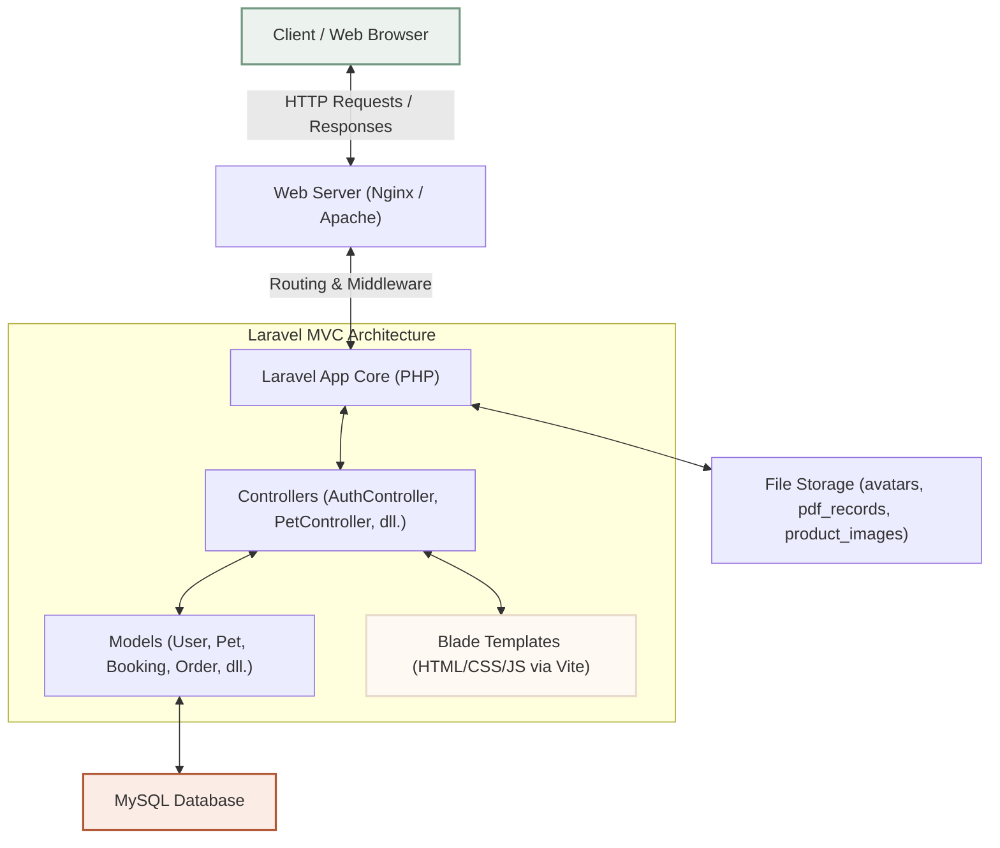
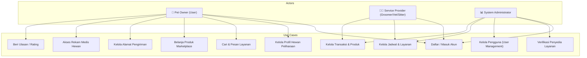
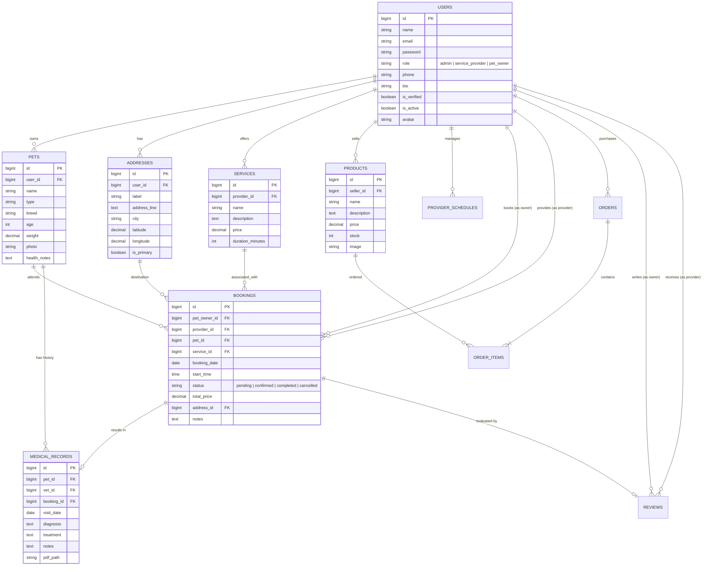
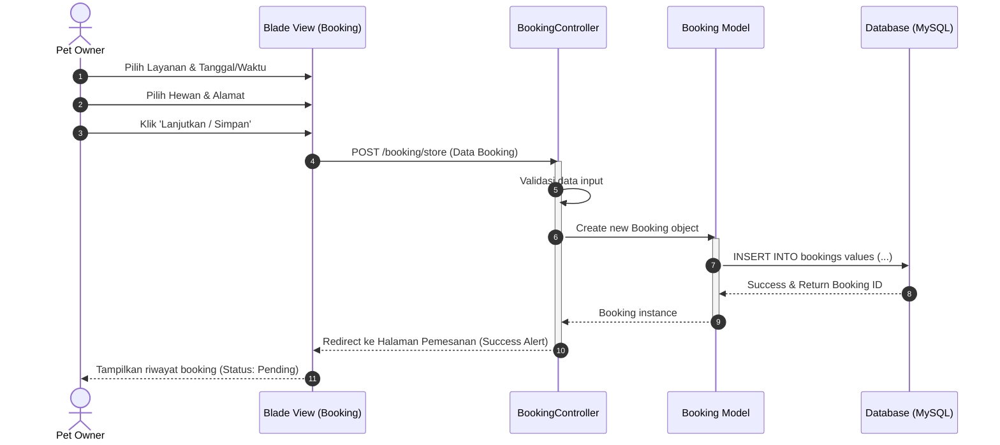
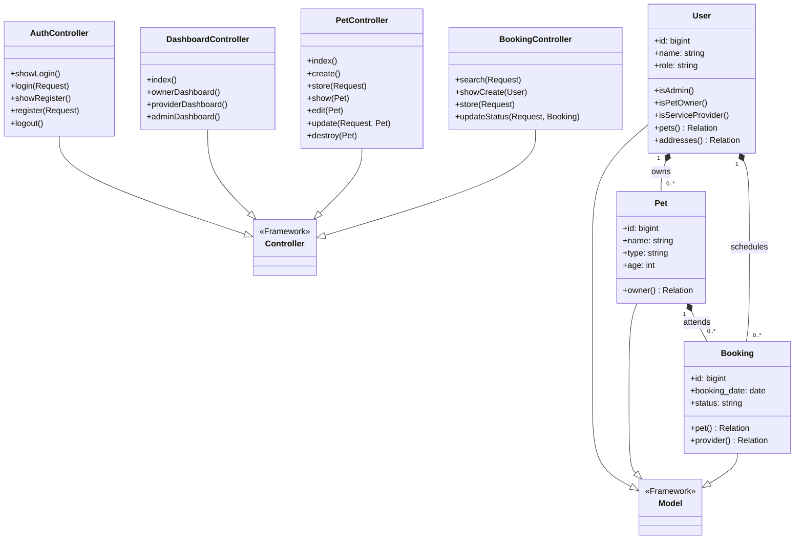
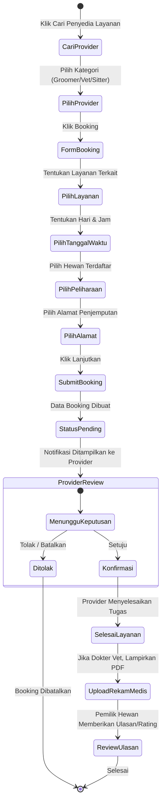

# Dokumen Desain Sistem & Arsitektur PawPal

Dokumen ini berisi spesifikasi teknis arsitektur, diagram aliran proses, diagram relasi entitas database (ERD), diagram kelas, diagram use case, serta tabel pemetaan kode dari aplikasi perayap dan pemesanan layanan perawatan hewan **PawPal**.

---

## 1. Diagram Arsitektur (Architecture Diagram)
Aplikasi PawPal dibangun menggunakan arsitektur **MVC (Model-View-Controller)** yang terstruktur dan aman berbasis PHP (Laravel Framework) serta dikompilasi secara dinamis dengan Vite & Tailwind/Bootstrap 5.

---

## 2. Diagram Use Case (Use Case Diagram)
Diagram berikut menggambarkan interaksi antara tiga aktor utama (**Pet Owner**, **Service Provider**, dan **Admin**) dengan fitur-fitur di dalam sistem PawPal.

---

## 3. Diagram Relasi Entitas (Entity Relationship Diagram - ERD)
Struktur tabel database relasional yang menyimpan seluruh informasi inti sistem PawPal.

---

## 4. Diagram Urutan (Sequence Diagram - Booking Layanan)
Proses berurutan saat seorang Pet Owner melakukan booking layanan perawatan hewan melalui aplikasi.

---

## 5. Diagram Kelas (Class Diagram - Pola MVC)
Representasi kelas-kelas utama (Controllers & Models) beserta hubungannya di dalam kode Laravel PawPal.

---

## 6. Diagram Aktivitas (Activity Diagram - Booking Flow)
Diagram alir aktivitas alur booking dari awal hingga selesai.

---

## 7. Tabel Pemetaan (Mapping Table)

### A. Pemetaan Database ke Model Eloquent
| Nama Tabel | Nama Model | Deskripsi |
| :--- | :--- | :--- |
| `users` | `User` | Menyimpan kredensial pengguna, peran, status verifikasi, dan biodata |
| `pets` | `Pet` | Profil data hewan peliharaan milik Pet Owner |
| `addresses` | `Address` | Alamat pengiriman/kunjungan lengkap beserta koordinat GPS |
| `services` | `Service` | Kategori layanan perawatan hewan yang ditawarkan oleh Provider |
| `products` | `Product` | Katalog produk pakan/perlengkapan hewan di marketplace |
| `provider_schedules` | `ProviderSchedule` | Jam dan hari operasional ketersediaan milik provider |
| `bookings` | `Booking` | Pemesanan kunjungan layanan (grooming/dokter/sitter) |
| `medical_records` | `MedicalRecord` | Digitalisasi rekam medis hewan pasca kunjungan dokter hewan |
| `reviews` | `Review` | Penilaian bintang (1-5) dan komentar dari Pet Owner untuk Provider |
| `orders` | `Order` | Transaksi invoice pesanan produk marketplace |
| `order_items` | `OrderItem` | Rincian produk dan kuantitas di dalam suatu pesanan/order |

### B. Pemetaan Rute, Kontroler, dan Tampilan (Routes, Controllers & Views)
| HTTP Method | URL Path | Nama Rute | Controller & Method | Blade View / Redirect |
| :--- | :--- | :--- | :--- | :--- |
| **GET** | `/` | `home` | *Closure* | `welcome.blade.php` |
| **GET** | `/login` | `login` | `AuthController@showLogin` | `auth/login.blade.php` |
| **POST** | `/login` | — | `AuthController@login` | *Redirect ke* `/dashboard` |
| **GET** | `/register` | `register` | `AuthController@showRegister` | `auth/register.blade.php` |
| **POST** | `/register` | — | `AuthController@register` | *Redirect ke* `/dashboard` |
| **POST** | `/logout` | `logout` | `AuthController@logout` | *Redirect ke* `/login` |
| **GET** | `/dashboard` | `dashboard` | `DashboardController@index` | *Redirect berdasarkan peran* |
| **GET** | `/owner/dashboard` | `owner.dashboard` | `DashboardController@ownerDashboard` | `owner/dashboard.blade.php` |
| **GET** | `/pets` | `pets.index` | `PetController@index` | `owner/pets/index.blade.php` |
| **GET** | `/pets/create` | `pets.create` | `PetController@create` | `owner/pets/create.blade.php` |
| **POST** | `/pets` | `pets.store` | `PetController@store` | *Redirect ke* `pets.index` |
| **GET** | `/pets/{pet}` | `pets.show` | `PetController@show` | `owner/pets/show.blade.php` |
| **GET** | `/pets/{pet}/edit` | `pets.edit` | `PetController@edit` | `owner/pets/edit.blade.php` |
| **PUT** | `/pets/{pet}` | `pets.update` | `PetController@update` | *Redirect ke* `pets.show` |
| **DELETE** | `/pets/{pet}` | `pets.destroy` | `PetController@destroy` | *Redirect ke* `pets.index` |
| **GET** | `/addresses` | `addresses.index` | `AddressController@index` | `owner/addresses/index.blade.php` |
| **GET** | `/booking/search` | `booking.search` | `BookingController@search` | `owner/search_providers.blade.php` |
| **GET** | `/booking/create/{provider}` | `booking.create` | `BookingController@showCreate` | `owner/create_booking.blade.php` |
| **POST** | `/booking/store` | `booking.store` | `BookingController@store` | *Redirect ke* `bookings.index` |
| **GET** | `/marketplace` | `marketplace.index` | `MarketplaceController@index` | `marketplace/index.blade.php` |
| **GET** | `/marketplace/cart` | `marketplace.cart` | `MarketplaceController@cart` | `marketplace/cart.blade.php` |
