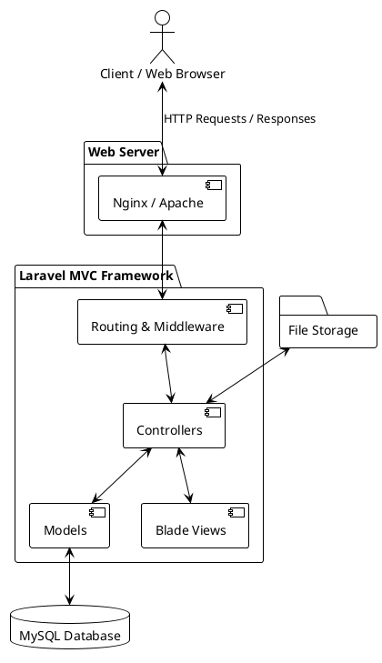
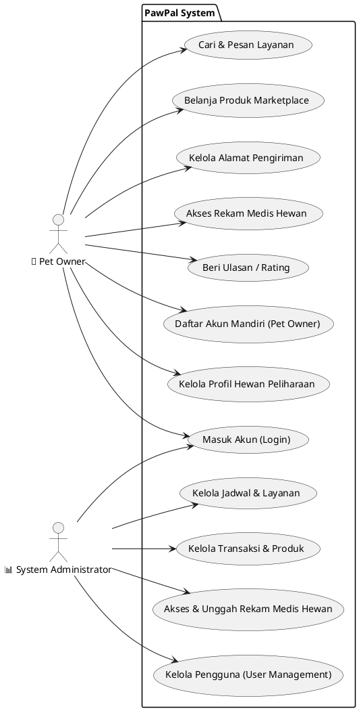
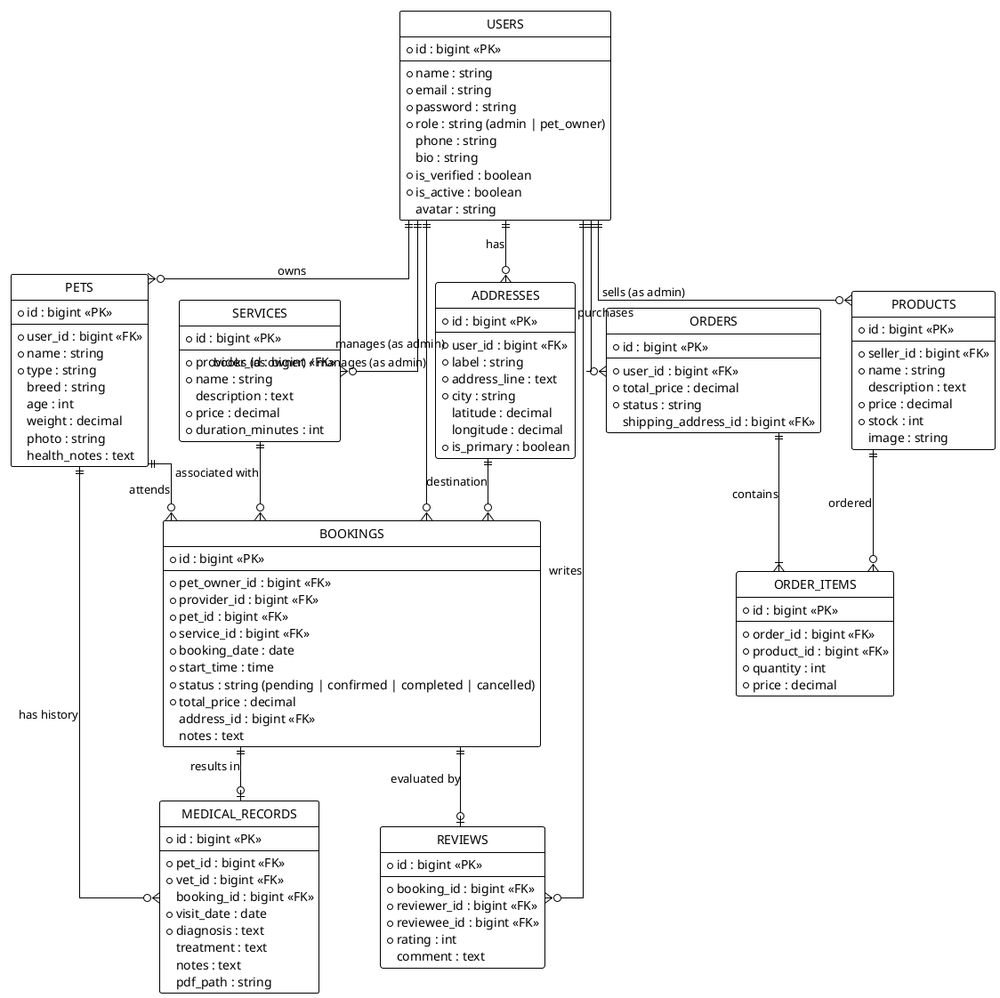
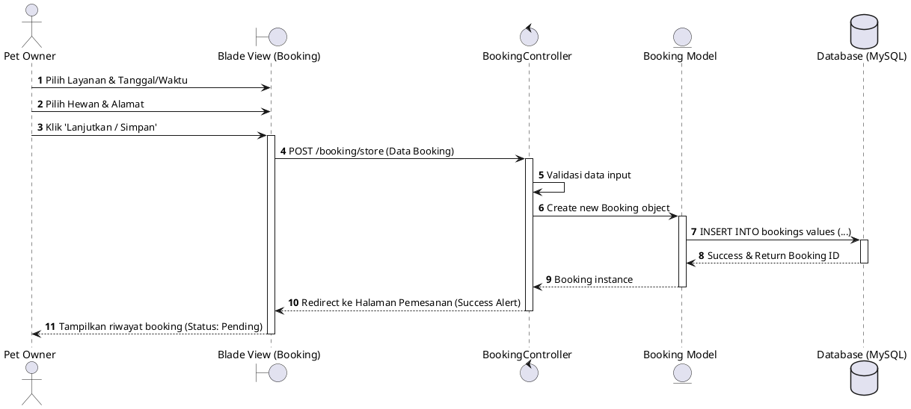
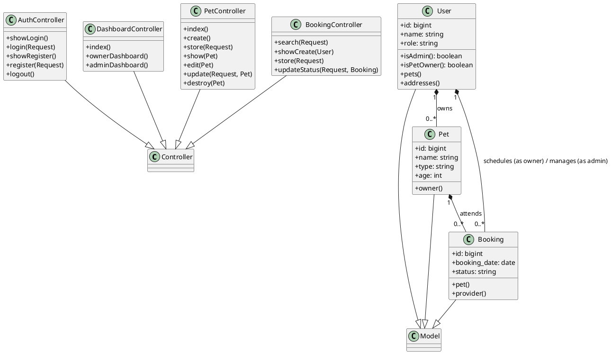
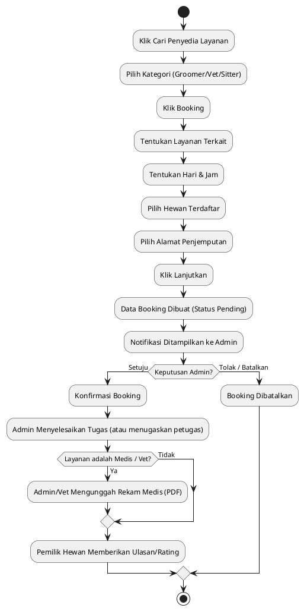

# Dokumen Desain Sistem & Arsitektur PawPal (PlantUML)

Dokumen ini berisi spesifikasi teknis arsitektur, diagram aliran proses, diagram relasi entitas database (ERD), diagram kelas, diagram use case, serta diagram aktivitas dari aplikasi perayap dan pemesanan layanan perawatan hewan **PawPal** dalam format **PlantUML**.

Seluruh file `.puml` terpisah juga dapat ditemukan di folder `puml/` pada proyek ini.

---

## 1. Diagram Arsitektur (Architecture Diagram)
File Sumber: [architecture.puml](file:///c:/Users/62899/.gemini/antigravity-ide/scratch/pet-care-prototype/puml/architecture.puml)

---

## 2. Diagram Use Case (Use Case Diagram)
File Sumber: [usecase.puml](file:///c:/Users/62899/.gemini/antigravity-ide/scratch/pet-care-prototype/puml/usecase.puml)

---

## 3. Diagram Relasi Entitas (Entity Relationship Diagram - ERD)
File Sumber: [erd.puml](file:///c:/Users/62899/.gemini/antigravity-ide/scratch/pet-care-prototype/puml/erd.puml)

---

## 4. Diagram Urutan (Sequence Diagram - Booking Layanan)
File Sumber: [sequence.puml](file:///c:/Users/62899/.gemini/antigravity-ide/scratch/pet-care-prototype/puml/sequence.puml)

---

## 5. Diagram Kelas (Class Diagram)
File Sumber: [class.puml](file:///c:/Users/62899/.gemini/antigravity-ide/scratch/pet-care-prototype/puml/class.puml)

---

## 6. Diagram Aktivitas (Activity Diagram)
File Sumber: [activity.puml](file:///c:/Users/62899/.gemini/antigravity-ide/scratch/pet-care-prototype/puml/activity.puml)

---

## 7. Tabel Pemetaan (Mapping Table)

### A. Pemetaan Database ke Model Eloquent
| Nama Tabel | Nama Model | Deskripsi |
| :--- | :--- | :--- |
| `users` | `User` | Menyimpan kredensial pengguna, peran, status verifikasi, dan biodata |
| `pets` | `Pet` | Profil data hewan peliharaan milik Pet Owner |
| `addresses` | `Address` | Alamat pengiriman/kunjungan lengkap beserta koordinat GPS |
| `services` | `Service` | Kategori layanan perawatan hewan yang ditawarkan oleh Provider |
| `products` | `Product` | Katalog produk pakan/perlengkapan hewan di marketplace |
| `provider_schedules` | `ProviderSchedule` | Jam dan hari operasional ketersediaan milik provider |
| `bookings` | `Booking` | Pemesanan kunjungan layanan (grooming/dokter/sitter) |
| `medical_records` | `MedicalRecord` | Digitalisasi rekam medis hewan pasca kunjungan dokter hewan |
| `reviews` | `Review` | Penilaian bintang (1-5) dan komentar dari Pet Owner untuk Provider |
| `orders` | `Order` | Transaksi invoice pesanan produk marketplace |
| `order_items` | `OrderItem` | Rincian produk dan kuantitas di dalam suatu pesanan/order |

### B. Pemetaan Rute, Kontroler, dan Tampilan (Routes, Controllers & Views)
| HTTP Method | URL Path | Nama Rute | Controller & Method | Blade View / Redirect |
| :--- | :--- | :--- | :--- | :--- |
| **GET** | `/` | `home` | *Closure* | `welcome.blade.php` |
| **GET** | `/login` | `login` | `AuthController@showLogin` | `auth/login.blade.php` |
| **POST** | `/login` | — | `AuthController@login` | *Redirect ke* `/dashboard` |
| **GET** | `/register` | `register` | `AuthController@showRegister` | `auth/register.blade.php` |
| **POST** | `/register` | — | `AuthController@register` | *Redirect ke* `/dashboard` |
| **POST** | `/logout` | `logout` | `AuthController@logout` | *Redirect ke* `/login` |
| **GET** | `/dashboard` | `dashboard` | `DashboardController@index` | *Redirect berdasarkan peran* |
| **GET** | `/owner/dashboard` | `owner.dashboard` | `DashboardController@ownerDashboard` | `owner/dashboard.blade.php` |
| **GET** | `/pets` | `pets.index` | `PetController@index` | `owner/pets/index.blade.php` |
| **GET** | `/pets/create` | `pets.create` | `PetController@create` | `owner/pets/create.blade.php` |
| **POST** | `/pets` | `pets.store` | `PetController@store` | *Redirect ke* `pets.index` |
| **GET** | `/pets/{pet}` | `pets.show` | `PetController@show` | `owner/pets/show.blade.php` |
| **GET** | `/pets/{pet}/edit` | `pets.edit` | `PetController@edit` | `owner/pets/edit.blade.php` |
| **PUT** | `/pets/{pet}` | `pets.update` | `PetController@update` | *Redirect ke* `pets.show` |
| **DELETE** | `/pets/{pet}` | `pets.destroy` | `PetController@destroy` | *Redirect ke* `pets.index` |
| **GET** | `/addresses` | `addresses.index` | `AddressController@index` | `owner/addresses/index.blade.php` |
| **GET** | `/booking/search` | `booking.search` | `BookingController@search` | `owner/search_providers.blade.php` |
| **GET** | `/booking/create/{provider}` | `booking.create` | `BookingController@showCreate` | `owner/create_booking.blade.php` |
| **POST** | `/booking/store` | `booking.store` | `BookingController@store` | *Redirect ke* `bookings.index` |
| **GET** | `/marketplace` | `marketplace.index` | `MarketplaceController@index` | `marketplace/index.blade.php` |
| **GET** | `/marketplace/cart` | `marketplace.cart` | `MarketplaceController@cart` | `marketplace/cart.blade.php` |
